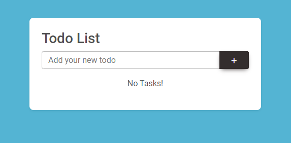
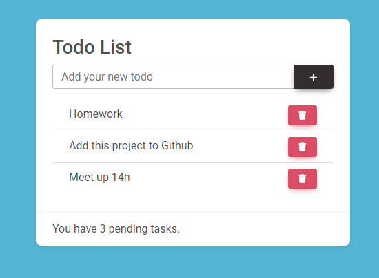

## About Project

For my first laravel project, I created a todo list. You can add or remove tasks to do from your list.

### Used technology

 - Laravel 9
 - Bootstrap
 - Font awesome
 - MDB

## Screenshots

